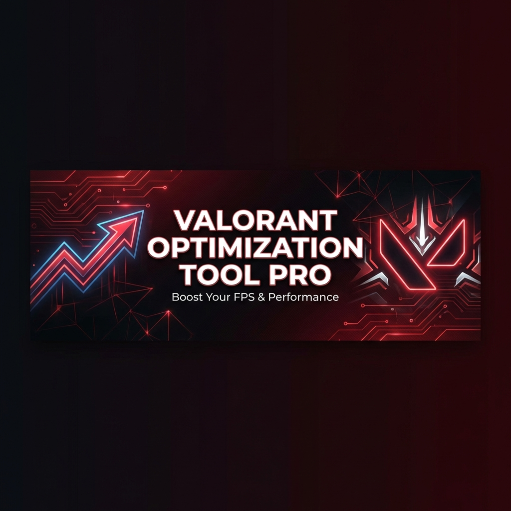
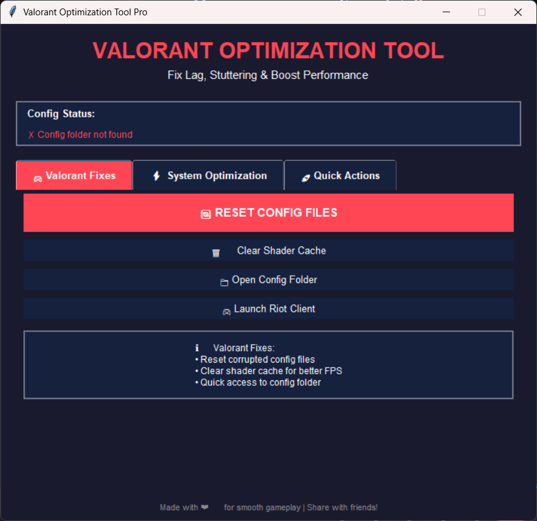
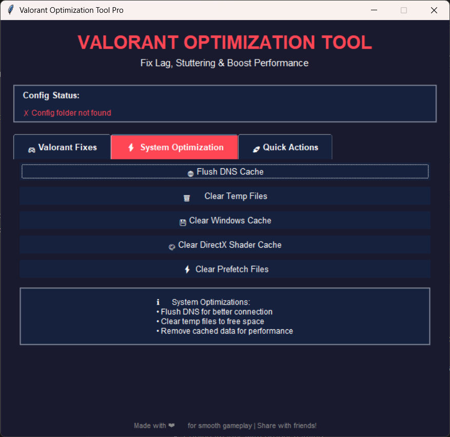
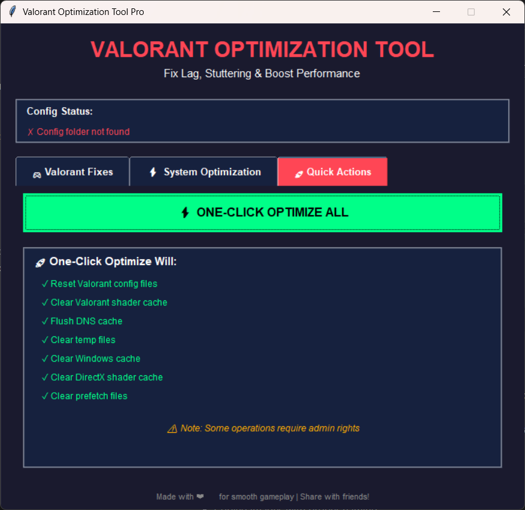

# Valorant Optimization Tool Pro



> **A powerful Windows optimization tool designed to fix Valorant performance issues, reduce lag, and boost FPS.**

Created by **ArushSengar**

---

## 📋 Table of Contents

- [Overview](#overview)
- [Features](#features)
- [Screenshots](#screenshots)
- [Installation](#installation)
- [Usage](#usage)
- [System Requirements](#system-requirements)
- [How It Works](#how-it-works)
- [Troubleshooting](#troubleshooting)
- [License](#license)
- [Author](#author)

---

## 🎯 Overview

Valorant Optimization Tool Pro is a comprehensive Windows application designed to resolve common Valorant performance issues including:
- Stuttering and jitter
- Increased input lag
- FPS drops
- Network latency issues

This tool provides both automated and manual optimization options through an intuitive graphical interface.

---

## ✨ Features

### Valorant-Specific Fixes
- **🔄 Config File Reset** - Backs up and resets Valorant configuration files to resolve corrupted settings
- **🎨 Shader Cache Clearing** - Removes corrupted shader cache that can cause stuttering
- **🚀 Quick Launch** - Launch Valorant directly from the tool
- **📂 Config Folder Access** - Quick access to Valorant configuration directory

### System Optimization
- **🌐 DNS Cache Flush** - Clears DNS cache to improve network performance
- **🗑️ Temp Files Cleanup** - Removes temporary files that can slow down your system
- **💾 Windows Cache Clearing** - Cleans Windows cache for better performance
- **🎮 DirectX Cache Cleanup** - Removes DirectX shader cache
- **⚡ Prefetch Clearing** - Clears Windows prefetch data

### Quick Actions
- **🔥 One-Click Optimization** - Run all optimizations with a single click
- **📊 Real-time Status** - Monitor optimization progress in real-time
- **✅ Config Status Check** - Verify if Valorant config files exist

---

## 📸 Screenshots

### Valorant Fixes Tab


*The main interface showing the Valorant Fixes tab with config reset, shader cache clearing, and quick launch options*

### System Optimization Tab


*System-wide optimizations including DNS flush, temp file cleanup, Windows cache clearing, DirectX cache cleanup, and prefetch clearing*

### Quick Actions Tab


*One-click optimization that runs all fixes simultaneously with a detailed checklist of operations*

---

## 💾 Installation

### Option 1: Download Executable (Recommended)
1. Download the latest release from the [Releases](../../releases) page
2. Extract the ZIP file to your desired location
3. Run `ValorantOptimizationTool.exe` as Administrator

### Option 2: Run from Source
1. Clone this repository:
   ```bash
   git clone https://github.com/ArushRajput/valorant-optimization-tool.git
   cd valorant-optimization-tool
   ```

2. Install Python 3.8 or higher from [python.org](https://www.python.org/downloads/)

3. Install required dependencies:
   ```bash
   pip install -r requirements.txt
   ```

4. Run the application:
   ```bash
   python valorant_config_tool.py
   ```

### Option 3: Batch Script (Quick Fix)
For a quick config reset without the GUI:
1. Run `fix_valorant_lag.bat` as Administrator
2. Follow the on-screen instructions

---

## 🎮 Usage

### First Time Setup
1. **Run as Administrator** - Right-click the executable and select "Run as administrator"
2. The tool will automatically detect your Valorant installation

### Fixing Lag/Stutter Issues
1. Navigate to the **Valorant Fixes** tab
2. Click **"Reset Config Files"** to backup and reset your Valorant settings
3. Click **"Clear Shader Cache"** to remove corrupted shader files
4. Launch Valorant and reconfigure your video settings

### System-Wide Optimization
1. Navigate to the **System Optimization** tab
2. Click individual optimization buttons or use **"Optimize All"** in the Quick Actions tab
3. Wait for the operations to complete
4. Restart Valorant for best results

### Quick Actions
1. Navigate to the **Quick Actions** tab
2. Click **"Run All Optimizations"** for a comprehensive cleanup
3. Monitor progress in the real-time log window

---

## 💻 System Requirements

- **Operating System**: Windows 10/11 (64-bit)
- **Permissions**: Administrator rights required
- **Valorant**: Must be installed and run at least once
- **Python** (if running from source): Python 3.8 or higher

---

## 🔧 How It Works

### Config File Reset
The tool backs up your current Valorant configuration files to:
```
%LOCALAPPDATA%\VALORANT\Saved\Config_Backup_[timestamp]
```
Then deletes the active config folder, forcing Valorant to regenerate fresh settings.

### Shader Cache Clearing
Removes shader cache from:
- `%LOCALAPPDATA%\VALORANT\Saved\ShaderCache`
- DirectX shader cache locations

### System Optimizations
- Flushes DNS resolver cache using `ipconfig /flushdns`
- Clears temporary files from `%TEMP%` and Windows temp directories
- Removes Windows prefetch data
- Cleans DirectX shader cache

---

## 🐛 Troubleshooting

### "Config folder not found" Error
- Ensure Valorant is installed
- Launch Valorant at least once before using the tool
- Check if Riot Vanguard is running

### "Access Denied" Errors
- Run the tool as Administrator
- Disable antivirus temporarily (some may block file operations)
- Ensure no other programs are accessing Valorant files

### Tool Doesn't Start
- Install [Visual C++ Redistributable](https://aka.ms/vs/17/release/vc_redist.x64.exe)
- Check Windows Event Viewer for error details
- Try running from source with Python

### Still Experiencing Lag
1. Update your graphics drivers
2. Disable Windows Game Mode
3. Close background applications
4. Check your network connection
5. Verify Valorant game files through Riot Client

---

## 📜 License

This software is **free to use** for personal and commercial purposes.

**Terms:**
- ✅ Free to download and use
- ✅ Free to modify for personal use
- ✅ Free to distribute (unmodified)
- ❌ Not open source - source code modifications for redistribution are not permitted
- ❌ No warranty provided - use at your own risk

See [LICENSE](LICENSE) for full details.

---

## 👤 Author

**ArushSengar**

- GitHub: [@ArushSengar](https://github.com/ArushRajput)
- Created: 2026

---

## ⚠️ Disclaimer

This tool modifies Valorant configuration files and Windows system settings. While designed to be safe:
- Always backup important data before use
- Use at your own risk
- The author is not responsible for any issues that may arise
- This is an unofficial tool and is not affiliated with Riot Games

---

## 🌟 Support

If this tool helped improve your Valorant performance, consider:
- ⭐ Starring this repository
- 🐛 Reporting bugs in [Issues](../../issues)
- 📢 Sharing with friends who play Valorant

---

## 📝 Changelog

### Version 1.0.0 (2026-01-14)
- Initial release
- Valorant config reset functionality
- Shader cache clearing
- System optimization tools
- GUI interface with tabbed layout
- Batch script for quick fixes

---

**Made with ❤️ for the Valorant community**
